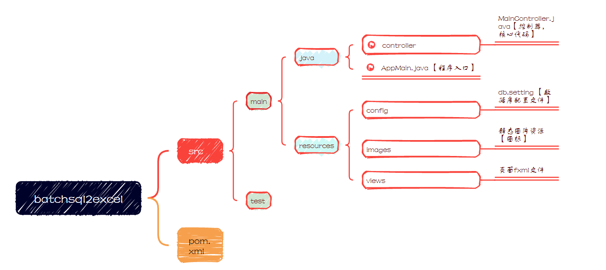
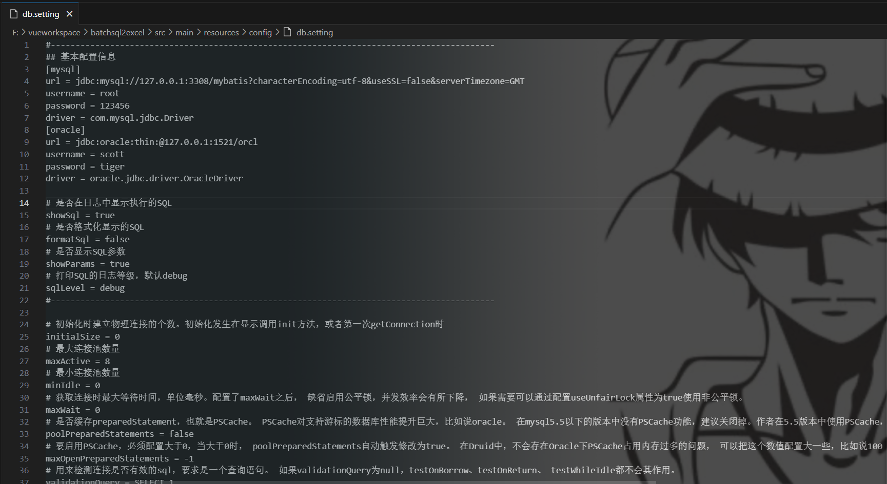
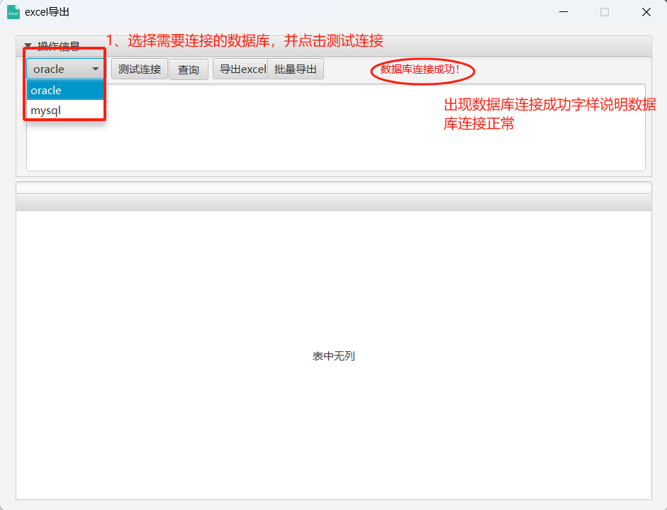
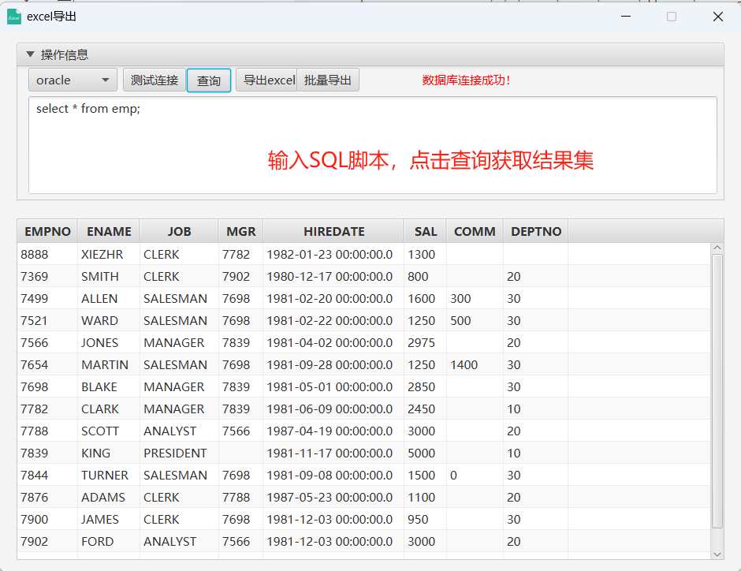
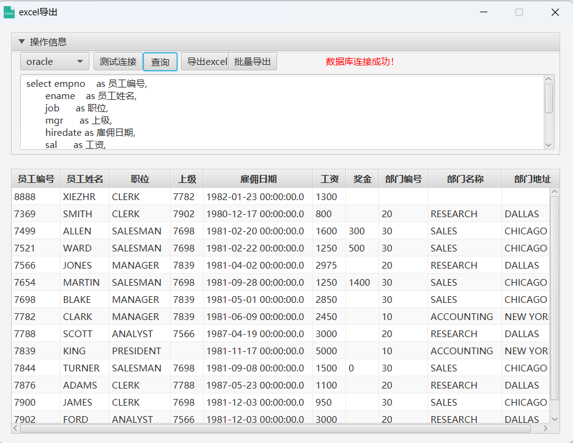
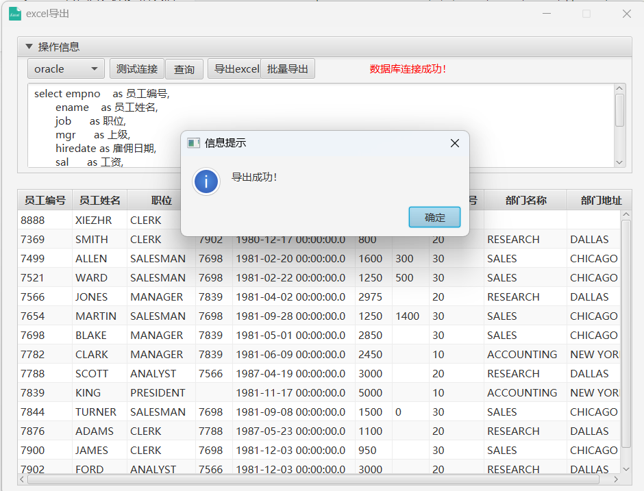

**严肃声明：现在、未来都不会有商业版本，所有代码全部开源!！**

如果这个项目让你有所收获，记得 Star 关注哦，这对我是非常不错的鼓励与支持。

### 🍉项目简介

项目主要实现通过读取配置文件连接`Oracle`或`MySQL`数据库，根据输入的动态`SQL`脚本展现数据结果集，

并将结果集导出到excel。项目通过JavaFx技术提供界面操作，对普通用户使用非常友好。

### 🍊项目结构

### 🍋操作步骤

🍓① 再db.setting配置文件中配置数据库连接信息

> 可配置多数据源，目前支持Oracle和MySQL，后续可扩展

🍓② 启动项目，检查数据库连接是否正常

🍓③ 输入动态SQL，获取数据结果集

🍓④ 将数据结果集导出成excel

 ### 🍅 未来计划

添加批量导出功能，即根据批量SQL脚本，批量导出excel。。。。
